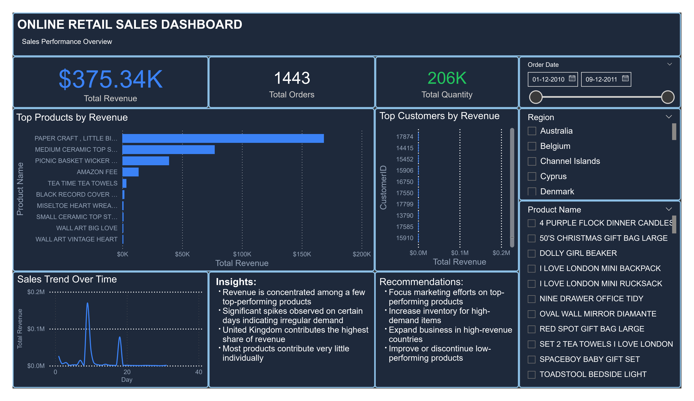

# Business Sales Performance Analytics
## Overview
This project focuses on analyzing business sales data to identify revenue trends, top-performing products, category-wise performance, and regional sales insights using Power BI.
The dashboard was designed to provide business-focused insights and support data-driven decision making through interactive visualizations and KPI analysis.

## Tools Used
* Power BI
* CSV Dataset
* Data Cleaning & Transformation

## Dashboard Features
* Revenue KPI Tracking
* Sales Trend Analysis
* Top-Selling Product Insights
* Category Performance Analysis
* Regional Sales Distribution
* Interactive Visualizations
* Business Recommendations

## Key Insights
* High-performing product categories contributed significantly to total revenue
* Certain regions generated stronger sales performance compared to others
* Sales trends showed fluctuations across different time periods
* A small number of products accounted for a major share of revenue

## Recommendations
* Focus marketing efforts on high-performing categories
* Improve sales strategies in underperforming regions
* Optimize inventory planning based on product demand trends
* Use seasonal trends to improve campaign performance

## Files Included
* `Business_Sales_Dashboard.pbix`
* `Business_Sales_Dataset.zip`
* `Dashboard_Preview.png`

## Dashboard Preview

